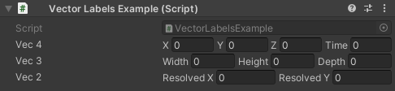

# VectorLabels

### Requires [Odin Inspector](https://odininspector.com/)

### Examples
Examples can be found in the downloaded files.

### Usage
Simply put the downloaded VectorLabels folder in your project
and start using the attribute as in the example file.
You can move the files, but make sure that `VectorLabelsAttribute.cs`
is not in an editor folder or it will be removed during build, causing errors.

Labels can be provided via [ValueResolvers](https://odininspector.com/documentation/sirenix.odininspector.editor.valueresolvers.valueresolver-1) or strings
